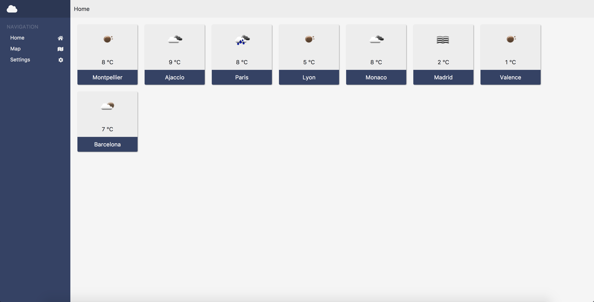
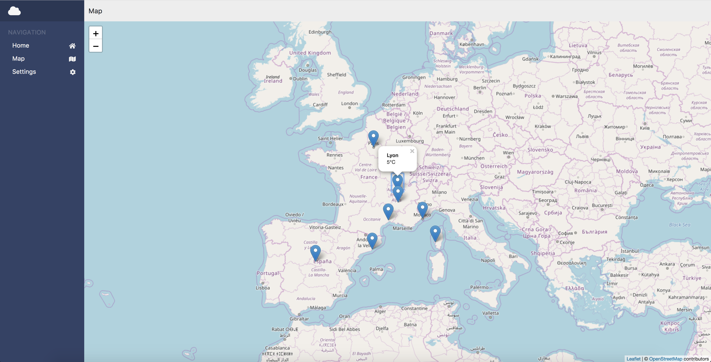

# Angular-weather

Le dashboard météo

## Mise en route

Ces instructions vous permettront d'obtenir une copie du projet opérationnel sur votre machine locale à des fins de développement et de test.

### Pré-requis

De quoi avez-vous besoin pour installer le logiciel et comment l'installer ?

```
npm
```

### Installation

Voici comment lancer le projet sur votre ordinateur:

Cloner et se placer dans le répertoire angular-weather

Installation des dépendences
```
npm install
```

Lancement de la webApp

```
npm start
```

## Captures d'écrans




## Construit avec

* [AngularJS](https://angularjs.org/)


## Auteurs

* **Romain Deguerville** - [RoromiDev](https://github.com/RoromiDev)
